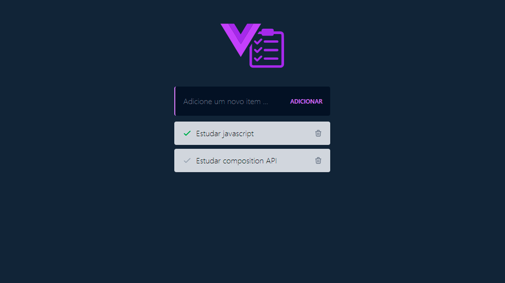

<h1 align="center">
  Aplicação de estudo - Vue
</h1>

<br>

<p align="center">
  
</p>

## ✨ Tecnologias

Esse projeto foi desenvolvido com as seguintes tecnologias:

- [Vue](https://vuejs.org/)
- [Vuex](https://vuex.vuejs.org/)
- [Typescript](https://www.typescriptlang.org/)
- [ViteJS](https://vitejs.dev/)
- [Tailwindcss](https://tailwindcss.com/)
- [json-server](https://github.com/typicode/json-server)

## 💻 Projeto

Aplicação foi desenvolvida como pratica de desenvolvimento, aplicando conhecimento obtidos em estudos sobre Vue 3.

## 📚 Descrição

Desenvolvimento de um Todo List aplicando conhecimento aprendido em Vue 3.

## 🚀 Como executar

- Clone o repositório
- Instale as dependências com `npm install`
- Inicie a fake api com `npm run server`
- Inicie o projeto em modo desenvolvedor com `npm run dev`
- Acesse a aplicação em `http://localhost:5173` porta default do ViteJS

> obs.: a api está configurada na porta 3000

## 📋 Como rodar o deploy

- Execute o comando `npm run deploy`

## 🔧 Descição do projeto

- ViteJS: A escolha pelo vite vem pelos seguinte ponto por se tratar de um projeto pequendo com base de valiar as habilidade Front End, o vite traz uma maior velocidade no starde do projeto, tendo configurações simplificadas, uma recaregamento rapido, tamanho do pacotes otimizados e suporte ao ES6.

- Tailwindcss: Outra ferramenta que traz maior agilidade no desenvolvimento, de facil configuração e totalmente compativel com o viteJs e Vue.

- Axios: O axios foi escolhido por se tratar de uma biblioteca de integração com a API, ele traz varias funcionalidades que contribuem para uma aplicação tratamento de erros, configuração de cabeçalho, tratamento de erros e muito mais, com isso o axios traz facilidade ao desenvolvimento.

- json-server: A api foi criada com a biblioteca json-server, que traz facilidade ao desenvolvimento, com configurações simples e otimizado para pequenos projetos.

- Vue Router: O Vue Router foi escolhido por se tratar de uma biblioteca de roteamento para Vue, não foi utilizado roteamentos mas foi realizado a configuração de roteamento para o projeto.

- Vuex: A escolha do Vuex vem por se tratar de uma biblioteca de estado para Vue, tendo um gerenciamento gerar dos dados da aplicação, facilitando o gerenciamento de dados.

## 🌳 Árvore de pastas

```bash
tudo-list-vue/
├─ .github/
│  └─ aplication.png
├─ .vscode/
│  └─ extensions.json
├─ db/
│  └─ database.json
├─ public/
│  └─ logo.svg
├─ src/
│  ├─ assets/
│  │  ├─ img/
│  │  │  └─ spinner.svg
│  │  └─ vue.svg
│  ├─ components/
│  │  ├─ TodoEmpty.vue
│  │  ├─ TodoFormAdd.vue
│  │  ├─ TodoHeader.vue
│  │  ├─ TodoItem.vue
│  │  ├─ TodoItens.vue
│  │  └─ TodoSpinner.vue
│  ├─ router/
│  │  └─ index.ts
│  ├─ store/
│  │  └─ index.ts
│  ├─ views/
│  │  └─ TodoListView.vue
│  ├─ App.vue
│  ├─ main.ts
│  ├─ shims-vue.d.ts
│  └─ style.css
├─ .gitignore
├─ index.html
├─ package-lock.json
├─ package.json
├─ README.md
├─ tsconfig.app.json
├─ tsconfig.json
├─ tsconfig.node.json
└─ vite.config.ts
```
